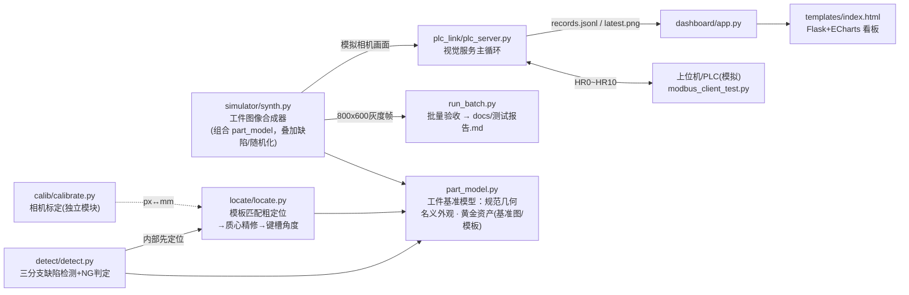

# 工件视觉定位与缺陷检测系统（仿真版）

> **免责声明（务必阅读）**：本项目为**求职作品集/学习演示用途的仿真项目**，
> 无真实工业相机与 PLC。工件图像由程序合成（模拟工业相机俯拍画面），PLC
> 由 Modbus/TCP 从站软件模拟。**README 中所有性能指标均为"仿真验证值"**，
> 只证明算法链路与工程结构的正确性，不等价于真实产线性能；迁移到真实
> 设备需重新选型、标定与验收。

对传送带上的圆形法兰盘工件完成：**视觉定位**（中心/角度/缩放）→
**缺陷检测与 NG 判定**（划痕/崩边/污渍/螺栓孔偏移/螺栓孔缺失）→
**Modbus/TCP 联调上位机**（触发、寄存器回写、心跳、看门狗）→
**Web 看板实时展示**（ECharts）。

## 系统架构



> 依赖方向约定（ADR-0001）：**locate / inspect 只从 `part_model` 获取
> 工件几何与黄金资产，不 import 仿真器**；synth 是 part_model 的下游
> 组合者，仅作为"模拟相机"向批量验收与 PLC 循环供帧。

## 功能特性

- **工件基准模型**：规范几何 / 名义外观 / 黄金资产单源 `part_model.py`，
  生产算法零依赖仿真器（ADR-0001）；匹配模板落盘缓存 + 参数指纹自愈；
- **合成器**：图层成像链路仿真（仿射位姿 ±100px/±30°/0.9~1.1 倍、亮度
  ±20%、高斯噪声），5 类缺陷注入 + 同帧解析真值 JSON，`--seed` 可复现；
- **标定**：正向畸变仿真棋盘格 → `calibrateCamera` → 重投影误差验收
  （实测 0.0919px ≤ 0.5px 门槛，仿真验证值）+ 像素当量 px↔mm 换算；
- **定位三级流水线**：模板匹配粗定位 → 凸包质心精修中心/缩放 → 键槽角向
  剖面精修角度；批量误差统计接口；
- **三分支检测**：基准比对（划痕/污渍）+ 外圆轮廓剖面（崩边）+ 霍夫粗检
  与径向剖面亚像素精测（孔偏移/缺失）；规则表 NG 判定 + 标注图输出；
- **PLC 联调**：HR0~HR10 寄存器协议、两段式状态同步、2s 看门狗、双路径
  心跳、10 项端到端自测（退出码可直接入 CI）；
- **看板**：当前帧标注图、良率仪表盘、节拍曲线、NG 类型饼图、最近 50 条
  记录表、手动触发按钮（走真实 Modbus 写 HR0=1）；
- **一键验收**：`run_batch.py` 批量 N 张 → 混淆矩阵 / 类型检出率 / 定位
  误差 / 节拍 → 自动生成 `docs/测试报告.md`，门槛 PASS/FAIL + 退出码。

## 快速开始

环境：Windows 10/11 · Python 3.12 · 仅开源库 OpenCV/NumPy/Flask/pymodbus

```powershell
git clone <本仓库>
cd Machine-Vision-Inspection-System
python -m venv .venv
.venv\Scripts\activate
pip install -r requirements.txt
```

按顺序体验（每步独立可跑）：

```powershell
:: 1) 相机标定（一次性；已有 data/calib/calibration.json 可跳过）
python calib/calibrate.py

:: 2) 合成数据集并人工查验（可选）
python simulator/synth.py --count 20 --defects --seed 42

:: 3) 批量验收：500 帧 → 检出率/误报率/混淆矩阵/节拍 → docs/测试报告.md
python run_batch.py --save-annot 6

:: 3.5) 单元测试（标准库 unittest，无需安装依赖）：
python -m unittest discover -s tests

:: 4) PLC 链路联调（两个终端）
:: 终端 A：
python plc_link/plc_server.py --seed 42
:: 终端 B（10 项自测，退出码 0=全过）：
python plc_link/modbus_client_test.py

:: 5) 看板（保持终端 A 运行，再开终端 B）
python dashboard/app.py
:: 浏览器打开 http://127.0.0.1:5001 ，点"手动触发检测"
```

单张调试示例：

```powershell
python locate/locate.py --image data/images/frame_000001.png --truth-dir data/truth
python detect/detect.py --image data/images/frame_000002.png   # 有真值时自动对照
```

## 性能指标（全部为仿真验证值）

环境：Windows 11 · Python 3.12.10 · OpenCV 5.0.0 · CPU 推理
完整口径见 `docs/测试报告.md` 与 `docs/系统设计说明书.md §7`。

### 相机标定（20 张棋盘格）

| 指标 | 实测 | 门槛 |
|---|---|---|
| 重投影误差 RMS | **0.0919 px** | ≤0.5px |
| 像素当量复检 | 0.10001 mm/px（设定 0.1） | ≈设定值 |

### 批量验收（500 帧，缺陷占比 50%，seed=42）

| 指标 | 实测（仿真验证值） | 验收目标 |
|---|---|---|
| 缺陷检出率（件级召回） | **100.00%**（TP=241 / FN=0） | ≥95% |
| 误报率 | **0.00%**（FP=0 / TN=259） | ≤5% |
| 判 NG 精确率 | 100.00% | — |
| 类型检出率 | 崩边 100% · 孔缺失 98.6% · 孔偏移 96.9% · 划痕 86.7% · 污渍 78.9% | — |
| 定位中心误差 | P95 **0.033 mm**（最大 0.051） | ≤0.3mm |
| 定位角度误差 | P95 **0.466°** | ≤0.8° |
| 单件节拍（定位+检测） | 平均 **73.8 ms** · P95 80.4ms | ≤400ms |

### 链路可靠性（仿真验证值）

| 项目 | 结果 |
|---|---|
| Modbus 端到端自测 | 10/10 PASS（含看门狗、故障恢复、双路径心跳） |
| 看门狗动作 | 触发后 ~2.1s 写故障码 999，迟到结果自动作废 |
| 看板闭环 | 页面/统计/经 Modbus 手动触发全通 |

## Modbus 寄存器规划（保持寄存器 HR，zero_mode）

| 地址 | 含义 | 编码 |
|---|---|---|
| HR0 | 触发命令 | 写 1=触发；写 2=触发并模拟卡死（看门狗测试）；处理后清零 |
| HR1 | 忙闲状态 | 0=空闲 1=忙 2=完成（本次结果有效） |
| HR2 | 结果码 | 0=无 1=OK 2=NG 999=看门狗故障 |
| HR3 | 缺陷位组合 | bit0划痕 bit1崩边 bit2污渍 bit3孔偏移 bit4孔缺失 bit5定位失败 |
| HR4/5 | X/Y 定位偏差 | int16，0.01mm 定点，两补码有符号 |
| HR6 | 工件角度 | int16，0.1° 定点，两补码有符号 |
| HR10 | 心跳计数 | uint16 自然回绕 |

客户端同步约定：写触发后**先等 HR1=1（受理）再等 HR1=2（完成）**——上一轮
的 DONE 会一直保持到下一轮被消费，直接轮 DONE 会读到旧结果。

## 目录结构

```
├── config.py                  全局参数唯一入口（调参只改这里）
├── part_model.py              工件基准模型：规范几何/名义外观/黄金资产
├── run_batch.py               批量验收 → docs/测试报告.md
├── simulator/synth.py         图像合成器 + 真值（组合 part_model，叠加缺陷注入）
├── calib/calibrate.py         相机标定 + 像素当量
├── locate/locate.py           三级定位流水线
├── detect/detect.py           三分支缺陷检测 + NG 判定
├── plc_link/plc_server.py     Modbus 从站 + 视觉主循环 + 看门狗
├── plc_link/modbus_client_test.py  上位机视角端到端自测
├── dashboard/app.py           Flask 看板后端
├── dashboard/templates/index.html  ECharts 看板页面
├── tests/test_part_model.py   工件基准模型单元测试（unittest）
└── docs/                      设计说明书 / 测试报告 / 验收清单 / ADR
```

## 常见问题

- **打开看板却是别的页面**：5000/5001 端口被其他开发服务占用（Windows 允许
  重复绑定但请求进先绑定者）。改 `config.py` 的 `DASH_PORT` 后重启。
- **Modbus 连不上 / 触发无反应**：确认 plc_server 已启动且 502 未被旧进程
  占用（`netstat -ano | findstr :502`）；客户端必须等状态迁移（见上）。
- **控制台中文乱码**：PowerShell 显示编码问题，不影响文件内容；可
  `python -X utf8 ...` 或用 `chcp 65001`。
- **ECharts 加载失败**：CDN 不可用时页面会自动切换备用源；内网部署请把
  echarts.min.js 放本地并改 index.html 引用。

## 文档

- [CONTEXT.md](CONTEXT.md)：领域术语表（工件基准模型/黄金资产/规范位姿
  等概念的单一出处）
- [docs/adr/0001-production-no-simulator-dep.md](docs/adr/0001-production-no-simulator-dep.md)：
  ADR-0001 生产算法不得依赖仿真器 —— 工件定义单源 part_model
- [docs/架构改进路线.md](docs/架构改进路线.md)：重构方法学 + 候选台账
  （回归工具 tools/metrics_diff.py 用法）
- [docs/系统设计说明书.md](docs/系统设计说明书.md)：架构、算法选型理由、
  公差依据、调参复盘
- [docs/测试报告.md](docs/测试报告.md)：run_batch 自动生成的完整验收报告
- [docs/验收清单.md](docs/验收清单.md)：逐条打勾验收
